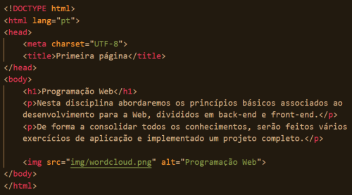

**UNIVERSIDADE LUSÓFONA DE HUMANIDADES E TECNOLOGIAS**

# Laboratório 1: Conhecer a Internet com a minha primeira página Web 

**OBJECTIVO**: Nesta ficha criará uma página na Web e disponibilizá-la-á num servidor na nuvem, numa conta criada por si, analisando alguns aspetos. Deverá anotar e reportar todos os aspectos observados numa nova página que deverá criar e carregar igualmente, intitulada de report.html.

**PRÉ-REQUISITOS**: Instale o VS Code para editar o código HTML. 

# 1. Alojamento de página Web na cloud

## Criação de uma página Web
Crie uma pasta lab1. Dentro dessa pasta, crie o ficheiro index.html com o seguinte código fonte HTML.

Crie, na pasta lab1, a pasta img, e guarde dentro desta a imagem  wordcloud.png.

Abra o ficheiro index.html com um Browser para ver se visualiza a imagem em baixo.

## Criação de repositório GitHub
Crie um repositório no GitHub, e faça push dos conteúdos da pasta lab1.

## Alojamento no Heroku
Crie uma conta no Heroku. Sincronize o GitHub com o Heroku, de forma a colocar disponível a página na cloud. Visualize a sua página no URL disponibilizado.

# 2. Conhecer a Internet

Vamos entender o modelo cliente-servidor da Internet. O browser do seu computador é o cliente, que faz pedido da página ao servidor Heroku onde está a sua página.

## Endereços IP
* Anote qual o endereço IP do seu computador. Pode obter isso de várias formas. A mais simples é perguntar no Google "what is my ip".
* Anote qual o endereço IP do seu telemóvel.
* Anote onde está localizado, usando por exemplo a ferramenta https://whatismyipaddress.com/ip-lookup
* Anote qual o endereço IP da máquina onde está alojada a sua página no Heroku, e onde este está localizado.

## Percurso
Traceroute (comando tracert) é uma ferramenta de diagnóstico que rastreia a rota que um pacote faz desde o seu computador até ao endereço IP destino. Este identifica os routers pelos quais esse pacote passa até o seu destino, indicando o tempo que demorou a chegar là. 

Abra a linha de comando e escreva tracert e especifique o endereço IP obtido anteriormente:
``> traceroute <endereço IP ou URL sua app>``
Usando o website https://db-ip.com/, anote os tuplos (cidade,pais) por onde o pacote passou para chegar ao seu destino. 

Explore também a ferramenta http://en.dnstools.ch/visual-traceroute.html, onde pode ver gráficamente a rota, a partir da Suíça. 

# 3. Acesso via HTTP à minha página Web

## HTTP
Web browsers (clientes HTTP) são aplicações que, usando o protocolo HTTP, comunicam com servidores na Internet fazendo pedidos de conteúdos ou enviando dados ao servidor. Em resposta a um pedido, o servidor envia uma resposta com conteúdos, o cliente recebendo assim uma resposta ao seu pedido. Esta é a arquitetura cliente-servidor. 

Tipicamente, corresponde ao cliente que navega e pede páginas com conteúdos ao servidor, e recebe e processa as respostas. Existem muitos navegadores tais como Chrome, Firefox, Safari. Recebem ficheiros em formato HTML que conseguem representar visualmente nuam interface gráfica de visualização. Com a ferramenta de Snip (Tecla Windows + Shift + S) copie a imagem e guarde-a como um ficheiro jpg ou png.

No Chrome, insira o URL da sua página Heroku. Nesse instante será feito um pedido do conteúdo correspondente a esse URL, que lhe será enviado pelo servidor em modo de resposta. Visualise o código recebido, clicando com o botão direito do rato e selecionando "ver código fonte" (view page source) ou simplesmente premindo Ctrl + U. Verifique o que aparece: é o que escreveu!

## Inspect

Nessa mesma página faça agora inspect (botão direito do rato) ou selecione Ctrl+Shift+i. Selecione a barra network. Clique na janela  do seu browser onde está o URL do seu site e faça novamente Enter. Explique o que aparece?
* Anote quantos ficheiros são descarregados na sequencia de um clique num hiperlink.
* Anote o tipo de ficheiros. 
* Anote os timings de espera e de descarga.
* Selecione cada um dos ficheiros descarregados. Anote o que observa, quando seleciona:
   * preview
   * Headers
   * Timing

Faça o mesmo agora para o site da lusófona, observando apenas (sem necessidade de anotar :-)).

# 4. Página

Com base em todas estas observações crie uma nova página HTML, report.html, onde reporte tudo o que observou. Utilize etiquetas para estruturar o seu conteúdo, etiquetas de heading (h1, h2, h3, ....), assim como para listar (ul) e enumerar (ol). Inclua a imagem da localização do servidor Heroku onde está hospedada a sua página Web. Faça upload para o seu repositório no GitHub, e sincronize com o Heroku. Verifique que ambas as páginas estão operacionais.

# 5. Submissão do Laboratório
No Moodle, submeta o link da sua aplicação antes da sua próxima aula prática.
Esperamos que tenha gostado de conhecer um pouco da Internet!
