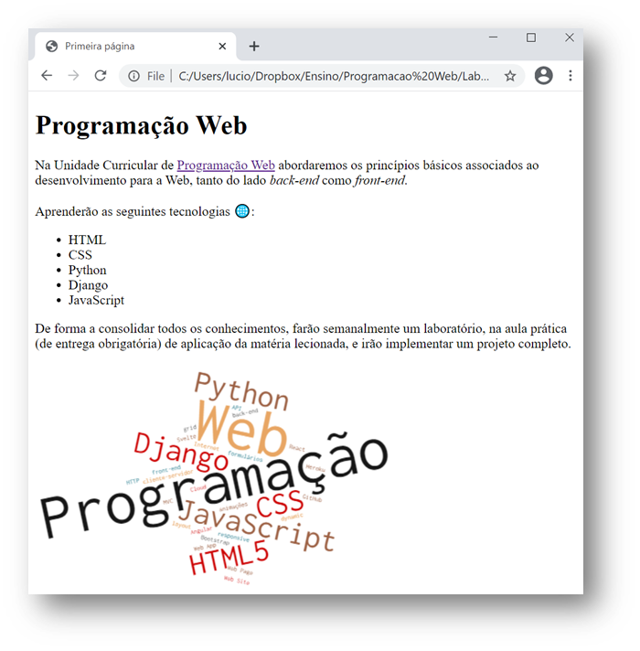

**UNIVERSIDADE LUSÓFONA DE HUMANIDADES E TECNOLOGIAS**

# Programação Web - Laboratório 1: Conhecer a Internet com a minha primeira página Web 

**OBJECTIVO**: Nesta ficha criará uma página na Web e disponibilizá-la-á num servidor na nuvem, numa conta criada por si. Irá  conhecer e analisar vários aspectos ligados com a Internet e o protocolo HTTP, que reportará numa nova página Web criada por si.

**PRÉ-REQUISITOS**: Instale o VS Code para editar o código HTML de forma fácil. Senão, pode sempre usar o Notepad++.

# 1. Alojamento de página Web na cloud

## Criação de uma página Web
Crie uma pasta lab1. Dentro dessa pasta, crie o ficheiro `index.html` com o seguinte código fonte HTML. 

```HTML
<!DOCTYPE html>
<html lang="pt">
<head>
    <meta charset="UTF-8">
    <title>Primeira página</title>
</head>
<body>
    <h1> Programação Web </h1>
    <p>Na Unidade Curricular de <a href="https://secure.grupolusofona.pt/ulht/moodle/course/view.php?id=38119">Programação Web</a> abordaremos os princípios básicos associados ao desenvolvimento para a Web, tanto do lado <i>back-end</i> como <i>front-end</i>.</p>
    <p>Aprenderão as seguintes tecnologias &#127760;:</p>
    <ul>
        <li>HTML</li>
        <li>CSS</li>
        <li>Python</li>
        <li>Django</li>
        <li>JavaScript</li>
    </ul>
    <p>De forma a consolidar todos os conhecimentos, farão semanalmente um laboratório, na aula prática (de entrega obrigatória) de aplicação da matéria lecionada, e irão implementar um projeto completo.</p>

    
</body>
</html>
```


O HTML é uma linguagem de marcação para construir páginas Web. OS ficheiros HTML possuem marcadores (*tags*), palavras entre parênteses angulares (`<` e `>`) que são comandos de formação da linguagem. 

No elemento `<title>Primeira página</title>`:
* `<title>` é o marcador de abertura
* `</title>` é o marcador de fecho
* `Primeira página` será o conteúdo afetado pelo marcador, que neste caso especificará o título da barra de navegação.

No ficheiro em cima poderá ver a utilização de vários marcadores:
* `h1` = marcador que define um titulo - heading1 (`h2` um subtítulo, `h3` um subsubtítulo, ...)
* `p` = marcador que define um parágrafo
* `u` = marcador que define uma lista não numerada
* `li` = marcador que define uma linha
* `img` = marcador que define uma imagem

Dentro de um marcador podem ser especificados pares de atributo = valor. Os atributos modificam os resultados padrões dos elementos e os valores caracterizam essa mudança. Existem neste ficheiro os seguintes atributos:
* `src` = atributo que define o nome do ficheiro com a imagem
* `href`= atributo que define o URL da hiperligação
Nas próximas aulas falaremos mais em detalhe destes aspectos.

Crie, na pasta `lab1`, a pasta `img`, e guarde dentro desta a imagem  `wordcloud.png` em baixo.


Uma vez editado, abra o ficheiro `index.html` com um Browser para ver se visualiza corretamente a imagem em baixo.


## Criação de repositório GitHub
Crie um repositório no GitHub `pw-lab1`, e faça push da pasta `lab1`.

## Alojamento no Heroku
Crie uma conta no Heroku. Sincronize o GitHub com o Heroku, de forma a colocar disponível na cloud a pasta `lab1` com seus conteúdos. 
De forma a conseguirem o alojamento na cloud com sucesso devem seguir os seguintes passos:
* Adicionar dois ficheiros na diretoria `root` da pasta
* * index.php
* * * Com o seguinte conteúdo: `<?php include_once("index.html")  ?>`
* * composer.json
* * * Com o seguinte conteúdo: `{}`
* Criar conta no Heroku - https://signup.heroku.com/login 
* Criar uma aplicação, atribuindo-lhe um nome
* Entrar nas definições da aplicação criada, e clicar na tab `Deploy`
* Na secção de `Deploy Method` devem conectar a aplicação com o Github
* Navegando até ao fim da página, até à secção `Manual deploy`, devem escolher o branch indicado do repositório e clicar em `Deploy branch`
* Um vez realizado com sucesso, devem clicar no botão `Open app` no topo da página, e visualizar a página HTML 


# 2. Conhecer a Internet

Vamos explorar alguns aspectos da Internet, a rede de routers e cabos que suporta Web. 

## Endereços IP
1. Obtenha informação sobre o IP do seu PC e seu telemóvel.
    * obtenha e anote o endereço IP do seu computador. Pode obter isso de várias formas. A mais simples é perguntar no Google "what is my ip". Anote onde está localizado, usando por exemplo a ferramenta https://whatismyipaddress.com/ip-lookup. guarde uma imagem do mapa que localiza.
    * Obtenha e anote a mesma informação do seu telemóvel, se tiver dados móveis.
1. Obtenha informação sobre o IP do servidor Heroku onde está a sua app.
    * Obtenha e anote o endereço IP do servidor Web onde está alojada a sua página no Heroku
    * anote onde este está localizado, usando a ferramenta https://whatismyipaddress.com/ip-lookup.  Guarde uma imagem do mapa que a localiza.

## Percurso
Traceroute (comando tracert) é uma ferramenta de diagnóstico que rastreia a rota que os pacotes IP fazem, desde o seu computador até um endereço IP destino/ou URL que especifique. Este identifica os routers pelos quais os pacotes passam até o seu destino, indicando o tempo que demoram por "salto" entre router. 

1. A forma mais clássica é através da linha de comando e escreva tracert e especifique o endereço IP obtido anteriormente:
``> traceroute <endereço IP ou URL sua app>``
1. Use a ferramenta GeoTraceroute, Em https://geotraceroute.com/, para visualizar graficamente por onde passam os pacotes IP, até chegar ao seu servidor Heroku. Escolha como origem (source) Portugal, e como destino o URL do seu site. Registe os saltos, indicando o país, e distância de cada salto. Quando fizer a página, pode procurar na Internet e inserir uma pequena image da bandeira do país. Com a ferramenta de Snip (Tecla Windows + Shift + S) copie a imagem do globo que cubra os saltos dados, e guarde-a como um ficheiro jpg ou png, para inserir também na página report.html.

# 3. Acesso via HTTP à minha página Web

## HTTP

O protocolo de troca de mensagens entre um cliente e um servidor Web é o HTTP. Um Web browser (Chrome, Safari, Firefox, etc) é uma aplicação que corre numa máquina "cliente" (o seu portátil por exemplo) e é capaz de enviar um pedido usando o protocolo HTTP a um servidor Web:
* O cliente pode pedir uma determinada página Web através de uma mensagem HTTP GET. O servidor Web irá responder-lhe a esse pedido, enviando os conteúdos correspondentes. Tipicamente é recebido um ficheiro HTML juntamente com algumas imagens e outros ficheiros auxiliares, sendo o browser capaz de representar visualmente o conteúdo. 
* O cliente pode também enviar ao servidor Web dados que preencheu por exemplo num formulário, através de uma mensagem HTTP POST. 
Esta é a arquitetura cliente-servidor. 

No seu browser, insira o URL da sua página Heroku. Nesse instante será feito enviado ao servidor Web um pedido (a mensagem chama-se mensagem HTTP GET) do conteúdo correspondente a esse URL, que lhe será enviado pelo servidor em modo de resposta. Visualise o código recebido, clicando com o botão direito do rato e selecionando "ver código fonte" (view page source) ou simplesmente premindo Ctrl + U. Verifique o que aparece: é o que escreveu!

## Inspect

Todos os browsers têm uma ferramenta (*browser developer tool*) que permite inspeccionar ficheiros descarregados pelo browser, permitindo analisar uma grande variedade de informação.
USe por exemplo o Chrome para abrir a sua página, e clicando no botão direito do rato, selecione *Inspect*, ou selecione Ctrl+Shift+i.

Selecione a barra network. Clique na janela  do seu browser onde está o URL do seu site e faça novamente Enter: 
* Explique o que aparece. Com a ferramenta de Snip (Tecla Windows + Shift + S) copie a imagem com info dos ficheiros descarregados. 
* Anote quantos ficheiros são descarregados na sequencia de um clique num hiperlink.
* Anote o tipo de ficheiros, timings de espera e de descarga.
* Selecione cada um dos ficheiros descarregados. Anote o que observa, quando seleciona:
   * preview
   * Headers
   * Timing

Faça o mesmo agora para o site da lusófona, mas aqui observando apenas (sem necessidade de anotar, pois a quantidade de informação é muito maior :-)).

# 4. Página Web Report.html

Com base em todas estas observações crie uma nova página HTML, report.html, onde reporte tudo o que observou.
* Utilize etiquetas para estruturar o seu conteúdo, etiquetas de heading (h1, h2, h3, ....), assim como para listar (ul) e enumerar (ol) (pesquise na internet, nna W3Schools, por exemplo https://www.w3schools.com/tags/tag_ul.asp).
* Inclua as imagens recolhidas da mesma forma que fez no index.html. 
* Faça upload para o seu repositório no GitHub, e sincronize com o Heroku. 
* Verifique que ambas as páginas estão operacionais.

A estrutura das pastas deverá ser como em baixo (com mais imagens na pasta img):
```
projeto
+-- lab1
|   +-- index.html
|   +-- report.html
|   +-- img
    |   +-- wordcloud.png
```

# 5. Submissão do Laboratório
Submeta o link da sua aplicação [aqui](https://drive.google.com/file/d/1kphRYAo78NSxWznBXHqNbPksELqlyloI/view) (procurando pelo seu nome na sua turma) antes da sua próxima aula prática, onde este será avaliado. 

Esperamos que tenha gostado de conhecer um pouco do funcionamento da Internet e de ter feito a sua primeira página Web &#127760;!
